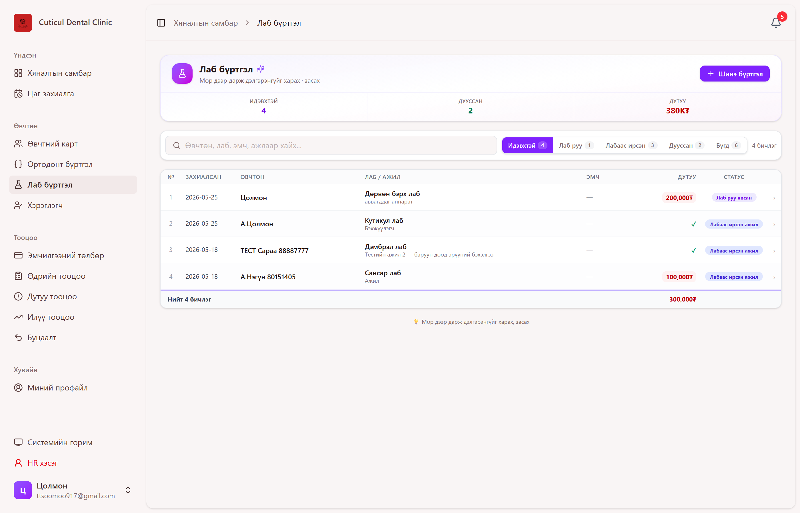
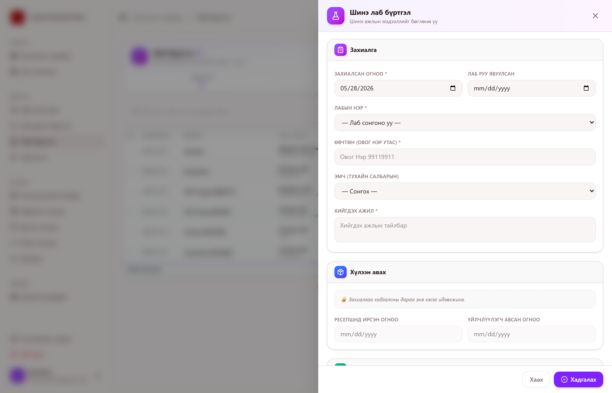
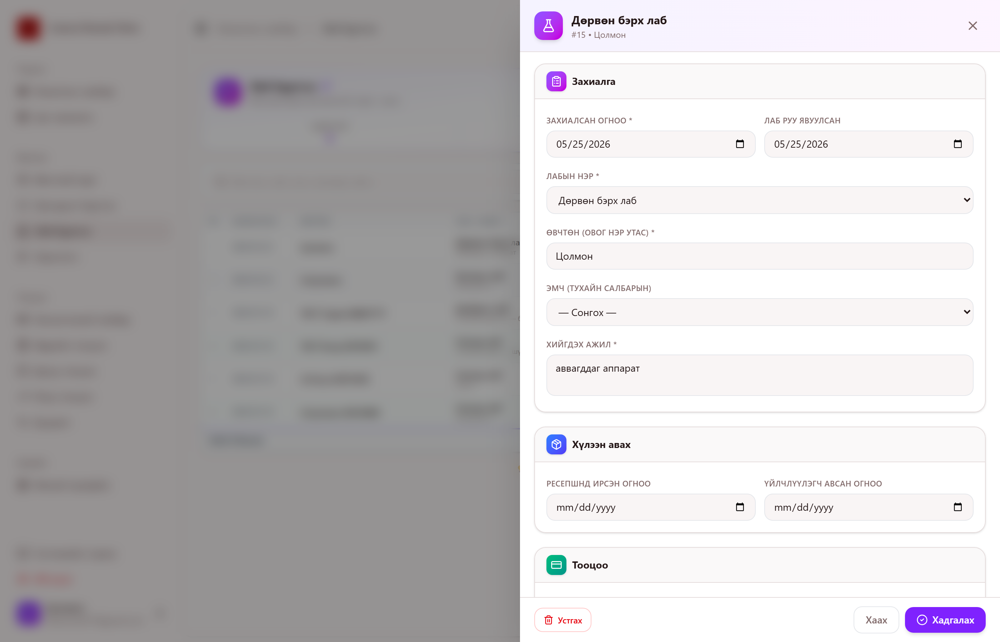
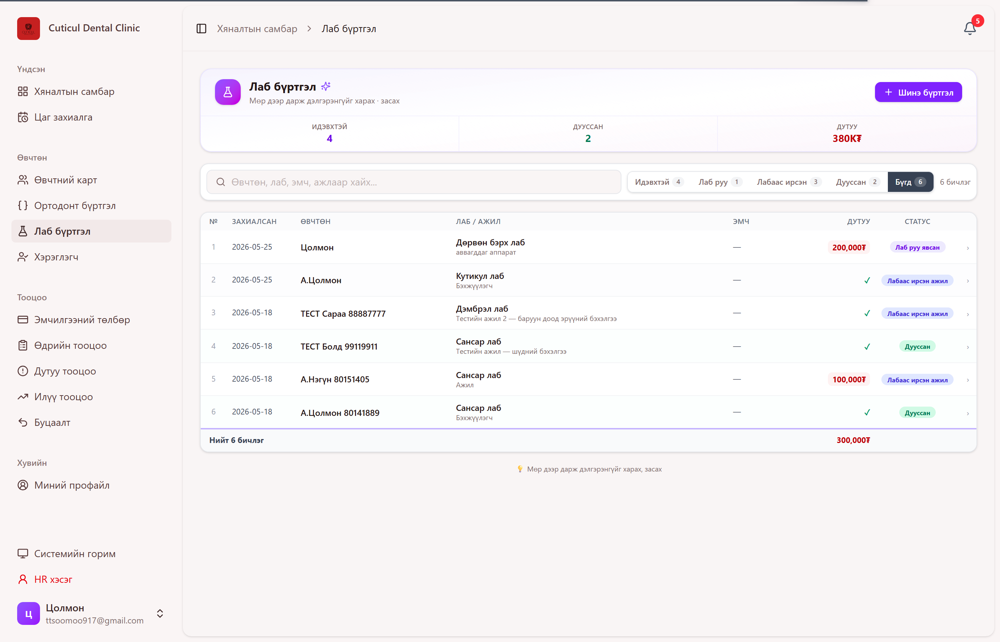
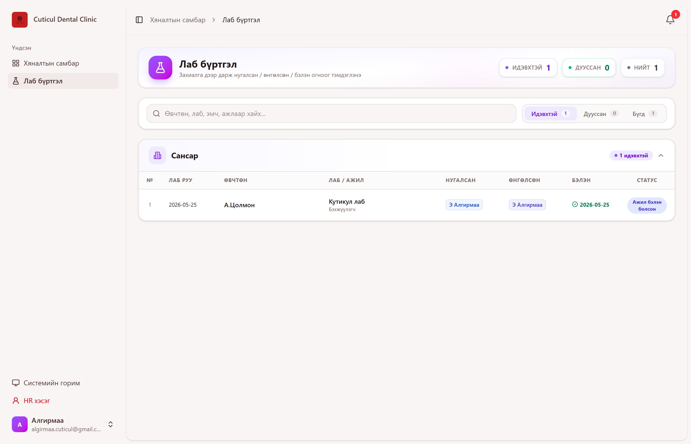
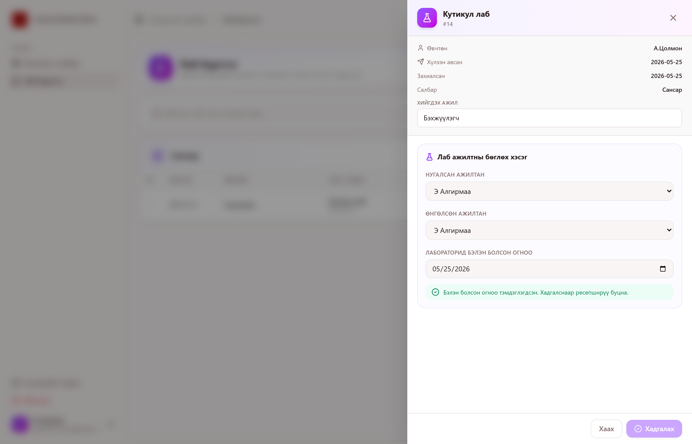
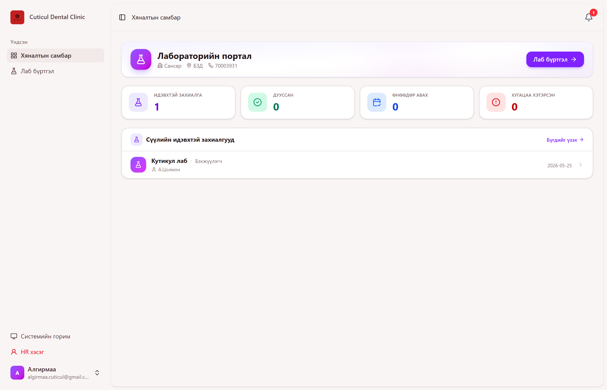

# Лаб бүртгэлийн ашиглах заавар

Энэхүү гарын авлага нь **Ресепшний лаб бүртгэл** болон **Лабын порталын** өдөр тутмын хэрэглээний дэлгэрэнгүй зааврыг агуулна.

---

## 1. Системийн тойм

Лабын ажил **2 портал**-аар явагдана:

| Портал | Хэн ашиглах | Хариуцлага |
| --- | --- | --- |
| **Ресепшний лаб бүртгэл** (`/reception/lab-orders`) | Ресепшн | Захиалга үүсгэх, лаб руу явуулсныг тэмдэглэх, хүлээн авах, тооцоо төлүүлэх |
| **Лабын портал** (`/lab/lab-orders`) | Лаб ажилтан | Нугалсан / Өнгөлсөн ажилтан сонгох, Лабораторид бэлэн болсон огноог тэмдэглэх |

### Лабын төрөл

Системд **5 лаб** дэмждэг:

- **Кутикул лаб** — *Дотоод лаб*. Лабын порталаар явна (нугалсан/өнгөлсөн ажилтны бүртгэлтэй).
- **Дөрвөн бэрх лаб**, **13-н лаб**, **Эвада лаб**, **Pro connect D лаб** — *Гадны лаб*. Лабын порталаар явахгүй. Ресепшн шууд "хүлээн авсан" хэсгийг бөглөнө.

> 💡 **Чухал**: "Кутикул лаб" сонгосон үед л Лабораторид (лаб ажилтны бөглөх) хэсэг харагдана.

---

## 2. Ресепшний ажлын урсгал

### 2.1 Үндсэн дэлгэц (`/reception/lab-orders`)

**Дэлгэцийн хэсгүүд:**

- **Шинэ бүртгэл** товч — баруун дээд буланд (ягаан өнгийн товч).
- **Статистик карт** — Идэвхтэй / Дууссан / Дутуу тооцооны нийт дүн.
- **Шүүлтүүр** — `Идэвхтэй`, `Лаб руу`, `Лабаас ирсэн`, `Дууссан`, `Бүгд`.
- **Хайлт** — Өвчтөн, лаб, эмч, ажлын тайлбараар хайна.
- **Хүснэгт** — мөр дээр дарвал тал дэлгэцийн drawer нээгдэнэ.

**Өнгөний утга (мөрийн дэвсгэр):**

- 🟢 Ногоон — Дууссан бүртгэл
- 🔴 Улаан — Авах хугацаа хэтэрсэн
- ⚪ Цагаан/саарал — Идэвхтэй

**Статусын тайлбар (баруун талын chip):**

| Статус | Утга |
| --- | --- |
| **Захиалсан** | Шинээр үүсгэсэн, лаб руу явуулаагүй |
| **Лаб руу явсан** | `Лаб руу явуулсан` огноо бөглөгдсөн |
| **Лабаас ирсэн ажил** | Лаб ажил бэлэн болсон (зөвхөн Кутикул лаб) |
| **Ресепшнд ирсэн** | `Ресепшнд ирсэн огноо` бөглөгдсөн |
| **Үйлчлүүлэгч авсан** | `Үйлчлүүлэгч авсан огноо` бөглөгдсөн |
| **Дууссан** | Бүх ажил дуусч, тооцоо хаагдсан |

> 🔄 **Realtime шинэчлэл**: Дэлгэц 5 секунд тутамд автоматаар шинэчлэгдэнэ. Лаб ажилтан портал дээрээ ажлаа тэмдэглэхэд та шууд харна.

---

### 2.2 Шинэ лаб бүртгэл үүсгэх

1. **"Шинэ бүртгэл"** товч дарна.
2. Баруун талаас slide-in хэлбэрээр **Drawer (хажуугийн самбар)** нээгдэнэ.
3. Дараах хэсгүүдийг бөглөнө:

#### Захиалга (заавал)

| Талбар | Тайлбар |
| --- | --- |
| **Захиалсан огноо** \* | Өнөөдрийн огноо автоматаар бөглөгдсөн байна. |
| **Лаб руу явуулсан** | Лаб руу хүлээлгэж өгсөн өдрөө бөглөнө. Дараа нь бөглөж болно. |
| **Лабын нэр** \* | Жагсаалтаас сонгоно (5 лабын аль нэг). |
| **Өвчтөн (Овог Нэр Утас)** \* | "Овог Нэр 99119911" хэлбэрээр бичнэ. |
| **Эмч** | Тухайн салбарын эмчийн жагсаалтаас сонгоно. |
| **Хийгдэх ажил** \* | Тайлбар бичнэ (ж.нь: "Дээд эрүүний дотор гүүр, 14–24"). |

#### Тооцоо

| Талбар | Тайлбар |
| --- | --- |
| **Төлөх дүн (₮)** | Үндсэн үнэ. |
| **Хөнг. %** | 0–100 хооронд. Хөнгөлөлт өгсөн бол энд хувиар бичнэ. |
| **Цэвэр төлөх дүн** | Автомат тооцоолно: `Төлөх дүн × (100 − %) / 100`. |
| **Төлсөн дүн (₮)** | Үйлчлүүлэгчийн төлсөн дүн. |
| **Дутуу үлдэгдэл** | Автомат тооцоолно. Улаанаар, эсвэл ногоон ✓ гэж харагдана. |

#### Тэмдэглэл

- Дурын нэмэлт тэмдэглэл.

4. **"Хадгалах"** ягаан товч дарна.

> ⚠️ **Анхаар**: `Өвчтөн`, `Лаб`, `Хийгдэх ажил` гурвыг бөглөхгүй бол алдааны мэдээлэл гарна.

---

### 2.3 Лаб руу явуулах

1. Хүснэгтийн мөр дээр даран Drawer нээнэ.
2. **"Лаб руу явуулсан"** огноог бөглөнө.
3. **"Хадгалах"**.

→ Статус **"Лаб руу явсан"** болж өөрчлөгдөнө.
→ Лабын ажилтан өөрийн портал дээр энэ бүртгэлийг харна.

---

### 2.4 Хүлээн авах (Reception receive)

#### А. Кутикул лабын ажил

1. Лаб ажилтан портал дээрээ **"Лабораторид бэлэн болсон огноо"**-г тэмдэглэсний дараа л "Хүлээн авах" хэсэг идэвхжинэ.
2. Лабаас ажил ирэхэд **"Ресепшнд ирсэн огноо"**-г бөглөнө.
3. Үйлчлүүлэгчид өгөхдөө **"Үйлчлүүлэгч авсан огноо"**-г бөглөнө.

> 🔒 Лаб ажил бэлэн болоогүй үед "Хүлээн авах" хэсэг **түгжээтэй** байна.

#### Б. Гадны лабын ажил

- "Хүлээн авах" хэсэг шууд идэвхтэй (лабын порталаар явахгүй).
- Захиалга хадгалсны дараа л идэвхжинэ. Шинэ үед түгжээтэй байна.

---

### 2.5 Тооцоо хаах, бүртгэл дуусгах

#### Бүх төлбөр төлөгдсөн тохиолдолд

1. `Төлсөн дүн` = `Цэвэр төлөх дүн` болгож засна.
2. `Үйлчлүүлэгч авсан огноо` бөглөгдсөн байх.
3. Доод хэсгийн **"Дуусгах"** (ногоон) товч дарна.

#### Дутуу үлдэгдэл үлдсэн тохиолдолд

Drawer-ийн доод хэсэгт **шар анхааруулга** + **"Дутуу тооцоо төлж дуусгах"** форм автомат гарч ирнэ:

1. **Баримтын дугаар** \* — өдрийн тооцооны нэр/баримтын дугаар (ж.нь: `A12345`, `RCP-001`).
2. **Төлбөрийн хэрэгсэл** \* — `Бэлэн / Карт / Мобайл / StorePay`.
3. **"X₮ төлж бүртгэл дуусгах"** ногоон товч дарна → баталгаажуулах диалог гарна → OK дарна.

> ⚠️ **Чухал**: Дутуу үлдэгдэлтэй үед энгийн "Дуусгах" товч **харагдахгүй**. Заавал баримтын дугаар + хэрэгсэл бөглөж дуусгана.

---

### 2.6 Дууссан бүртгэлийг **дахин засах**

1. Дууссан бүртгэлийг нээнэ.
2. Доод талд **"Дахин засах"** шар товч гарна.
3. Дарвал засварлах боломжтой болно.

---

### 2.7 Устгах

- Идэвхтэй (дуусаагүй) бүртгэл дээр л **"Устгах"** товч (улаан) харагдана.
- Дууссан бүртгэлийг устгахын тулд эхлээд **"Дахин засах"** дарж байж устгана.

---

### 2.8 Шүүлтүүрээр харах

`Идэвхтэй / Лаб руу / Лабаас ирсэн / Дууссан / Бүгд` товчуудаас сонгож хүснэгтийг шүүж харна. Зүүн талд хайлтын талбар бөглөвөл өвчтөн, лаб, эмч, ажлын тайлбараар нэмж шүүнэ.

---

## 3. Лабын порталын ажлын урсгал

### 3.1 Үндсэн дэлгэц (`/lab/lab-orders`)

- Лабын ажилтан зөвхөн өөрийн порталыг харна.
- Захиалгууд **салбараар бүлэглэгдсэн** — Top-down хэлбэрээр харагдана.
- 5 секунд тутамд автомат шинэчлэгдэнэ.

**Шүүлтүүр**: `Идэвхтэй / Дууссан / Бүгд`.

**Олон салбартай үед**:
- "Бүгдийг дэлгэх" — бүх бүлгийг нээх.
- "Бүгдийг хумих" — нэг товч дээр.

**Хүснэгт багана**:
- № / Лаб руу (огноо) / Өвчтөн / Лаб ажил / Нугалсан / Өнгөлсөн / Бэлэн / Статус

**Статусын утга (Лабын талаас)**:
| Статус | Утга |
| --- | --- |
| **Шинэ** | Ресепшнээс ирсэн, лаб руу явуулаагүй |
| **Хүлээж авсан** | `Лаб руу явуулсан` огноо бөглөгдсөн |
| **Ажил бэлэн болсон** | `Лабораторид бэлэн болсон огноо` тэмдэглэгдсэн |
| **Ресепшнд / Авсан / Дууссан** | Ресепшний дараагийн алхмууд |

---

### 3.2 Лабын ажилтны бөглөх алхам

1. Захиалгын мөр дээр дарж drawer нээнэ.
2. **"Лаб ажилтны бөглөх хэсэг"**-т:
   - **Нугалсан ажилтан** — жагсаалтаас сонгоно.
   - **Өнгөлсөн ажилтан** — жагсаалтаас сонгоно.
   - **Лабораторид бэлэн болсон огноо** — дуусгасан өдрөө бичнэ.
3. **"Хадгалах"** товч дарна.

#### Лабын хяналтын самбар

Лабын ажилтан зүүн талын **"Хяналтын самбар"** дотроос өдрийн ажлын тойм харах боломжтой.

> ✅ Огноо тэмдэглэгдсэний дараа ресепшн дээр энэ ажил "Хүлээн авах" төлвөөр идэвхжинэ.

> 🔒 Дууссан захиалгыг **засах боломжгүй**. Ресепшн "Дахин засах" хийсний дараа л дахин засагдана.

---

## 4. Жишээ урсгалууд

### Жишээ 1: Кутикул лабаар хийх дотоод ажил

| Алхам | Хэн | Үйлдэл |
| --- | --- | --- |
| 1 | Ресепшн | Шинэ бүртгэл → Лаб: **Кутикул лаб**, өвчтөн, ажил, төлөх дүн |
| 2 | Ресепшн | Лаб руу явуулсан огноог тэмдэглэх |
| 3 | Лаб ажилтан | Нугалсан / Өнгөлсөн ажилтан сонгох + Бэлэн огноо |
| 4 | Ресепшн | Ресепшнд ирсэн огноо |
| 5 | Ресепшн | Үйлчлүүлэгчид өгөхөд → Үйлчлүүлэгч авсан огноо + үлдэгдэл тооцоо хаах |
| 6 | Ресепшн | **Дуусгах** |

### Жишээ 2: Гадны лабаар (ж.нь. Эвада лаб) хийх ажил

| Алхам | Хэн | Үйлдэл |
| --- | --- | --- |
| 1 | Ресепшн | Шинэ бүртгэл → Лаб: **Эвада лаб**, өвчтөн, ажил, төлөх дүн → Хадгалах |
| 2 | Ресепшн | Лаб руу явуулсан огноог тэмдэглэх |
| 3 | Ресепшн | Ажил буцаж ирэхэд → Ресепшнд ирсэн огноо |
| 4 | Ресепшн | Үйлчлүүлэгчид өгөх → Авсан огноо + тооцоо хаах |
| 5 | Ресепшн | **Дуусгах** |

> 💡 Энэ урсгалд лабын ажилтан **оролцохгүй**.

### Жишээ 3: Хөнгөлөлт + Дутуу төлбөртэй дуусгах

1. Шинэ бүртгэл: Төлөх дүн `500,000₮`, Хөнгөлөлт `10%` → Цэвэр төлөх `450,000₮`.
2. Анхны төлбөр `300,000₮` → Дутуу `150,000₮`.
3. Үйлчлүүлэгч авахдаа үлдсэн `150,000₮`-ийг төлнө.
4. Drawer-т **"Дутуу тооцоо төлж дуусгах"** хэсэг гарна:
   - Баримтын дугаар: `A12345`
   - Хэрэгсэл: `Карт`
5. **"150,000₮ төлж бүртгэл дуусгах"** товч → ОК.

→ Энэ бүртгэл дуусч, дууссан бүртгэлийн хэсэгт төлбөрийн **баримт, хэрэгсэл, огноо** хадгалагдана.

---

## 5. Түгээмэл асуултууд (FAQ)

**А: Лаб ажилтан нь Лабын портал дээр захиалга харагдахгүй байна?**
- Ресепшний лаб бүртгэл дээр **"Лаб руу явуулсан"** огноог бөглөсөн эсэхийг шалгана уу.
- Лаб нэр нь **"Кутикул лаб"** биш бол лабын портал-аар явахгүй (гадны лаб).
- Дэлгэц 5 секунд тутамд шинэчлэгдэнэ. Шинэчлэлээ хүлээнэ үү.

**А: "Дуусгах" товч харагдахгүй байна?**
- `Дутуу үлдэгдэл > 0` бол энгийн Дуусгах товч харагдахгүй. Дутуу тооцоо төлөх формоор дуусгана.
- Шинэ бүртгэл хадгалаагүй үед Дуусгах товч идэвхгүй.

**А: "Ресепшнд ирсэн огноо" талбар түгжээтэй байна?**
- Кутикул лаб бол: лаб ажилтан "Бэлэн болсон огноо"-г тэмдэглэх хүртэл түгжээтэй.
- Гадны лаб бол: захиалга хадгалаагүй (шинэ үед) үед түгжээтэй. Эхлээд Хадгал.

**А: Дууссан бүртгэлийг яаж засах вэ?**
- Drawer нээж → "Дахин засах" товч дарна.

**А: Дутуу тооцоо төлсний дараа баримтын дугаар хаана харагдах вэ?**
- Дууссан бүртгэлийг нээхэд "Тооцоо" хэсэгт ногоон баннер дээр **Баримт / Хэрэгсэл / Огноо** мэдээлэл харагдана.

---

## 6. Чухал шалгах зүйлс

- ✅ Лабын нэрийг **зөв сонгох** — Кутикул лаб vs гадны лаб (урсгал өөр).
- ✅ Лаб руу явуулсан огноог **заавал** тэмдэглэх (статус, лабын портал хамаарна).
- ✅ Дутуу тооцоо үлдээж бүртгэл дуусгахгүй (заавал баримт + хэрэгсэл бичих).
- ✅ Лаб ажилтан зөвхөн нугалсан/өнгөлсөн/бэлэн огноог бөглөх — бусад мэдээллийг засахгүй.
- ✅ Realtime ажилладаг (5сек) — F5 дарах шаардлагагүй.
